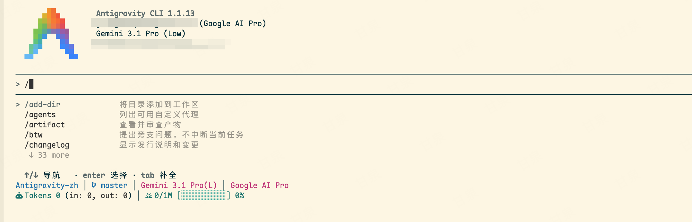

# Antigravity-zh — Antigravity CLI 简体中文汉化

> 为 Google Antigravity CLI（`agy`）提供简体中文界面汉化。
> **只做 UI 文字汉化，不碰任何功能逻辑。**

## 项目定位

本项目专注 Antigravity CLI 的终端界面，不修改 IDE 桌面壳。它采用机器可读翻译清单、
版本锁定的精确偏移补丁、原子替换和真实 TUI 验收，便于 AI 持续定位、翻译、验证和升级。

## 汉化效果



## 架构概述

AGY CLI 的显示来自 **三处**。本项目汉化 Go 二进制主体和已解包的内置 Skill
说明；HUD 保持插件原版：

```
┌──────────────────────────────────────────────────────────┐
│  第一层：HUD 插件（JavaScript，默认不汉化）               │
│  位置：插件源码 + ~/.gemini/antigravity-cli/...运行时    │
│  内容：状态栏 · 令牌统计 · 额度显示 · 元数据行            │
│  方式：保持上游原版，可选实验性汉化、可随时恢复            │
│  难度：★☆☆ 低                                            │
├──────────────────────────────────────────────────────────┤
│  第二层：Go 二进制主体                                    │
│  位置：~/.local/bin/agy (Mach-O arm64, ~170MB)           │
│  内容：斜杠命令右侧说明 · 快捷键提示 · 工具/权限状态       │
│  方式：官方哈希校验 + 精确偏移 patch + ad-hoc 重签名      │
│  难度：★★☆ 中                                            │
├──────────────────────────────────────────────────────────┤
│  第三层：已解包的内置 Skill                               │
│  内容：/agy-customizations、/antigravity-guide 右侧说明   │
│  方式：仅替换 SKILL.md 的 YAML description，并保留备份    │
└──────────────────────────────────────────────────────────┘
```

斜杠命令名及别名始终保持英文，例如 `/resume`、`/skills`；只汉化它们右侧的解释。

## 依赖

- macOS arm64
- `python3`、Node.js、Go（补丁、HUD 检查和偏移维护）
- `agy` v1.1.13（当前偏移表严格锁定此版本）
- `agy-hud` 插件（仅用于状态栏，保持原版）

## 快速开始

```bash
# 自动完成 HUD 原版检查、版本预检、安装和验收
bash scripts/install.sh
```

安装脚本不会汉化 HUD，也不会修改斜杠命令名。如果只想检查而不写入二进制：

```bash
bash scripts/patch_hud.sh --check-original
bash scripts/patch_binary.sh --dry-run
```

二进制层会保留 Google 原签名文件为 `~/.local/bin/agy.zh-backup`，汉化后的
可执行文件使用 macOS ad-hoc hardened-runtime 签名。升级到其他 `agy` 版本时，
SHA-256 或任一原文偏移不一致都会拒绝修改，不会把未知版本强行打补丁。
若检测到新的官方 Developer ID 签名版本，也不会用旧的 `.zh-backup` 将其覆盖。

## 回滚

```bash
# 仅在曾主动运行 --apply 时恢复 HUD；默认安装无需执行
bash scripts/patch_hud.sh --restore

# 二进制层回滚（从备份恢复）
bash scripts/patch_binary.sh --restore

# 内置 Skill 说明回滚
bash scripts/patch_skill_descriptions.sh --restore
```

## AI 维护入口

- [AGENTS.md](AGENTS.md)：AI 代理必须遵守的产品边界、信息源和完成定义；
- [AI_TRANSLATION_GUIDE.md](AI_TRANSLATION_GUIDE.md)：术语、占位符、字节预算和新增翻译流程；
- [ARCHITECTURE.md](ARCHITECTURE.md)：二进制、HUD 与内置 Skill 的实现原理；
- [SOP.md](SOP.md)：首次安装、官方升级、故障诊断和回滚步骤。

机器可读翻译只存放在 `i18n/*.json`；已安装文件、终端截图和 README 示例都不是翻译事实来源。

## 目录结构

```
Antigravity-zh/
├── README.md                    # 本文件
├── AGENTS.md                    # AI 代理维护契约
├── AI_TRANSLATION_GUIDE.md      # AI 汉化规范
├── ARCHITECTURE.md              # 架构与汉化原理详解
├── SOP.md                       # 升级与维护流程
├── LICENSE                      # MIT License
├── assets/
│   └── agy-cli-zh-preview.png   # README 汉化效果图
├── i18n/
│   ├── hud-translations.json    # HUD 可选实验翻译表
│   ├── binary-translations.json # 二进制层翻译表（en → zh 对照）
│   └── skill-translations.json  # 内置 Skill 菜单说明翻译表
├── scripts/
│   ├── patch_hud.sh             # HUD 可选汉化/原版恢复入口
│   ├── install.sh               # 默认安装与完整验收入口
│   ├── patch_binary.py          # 哈希、偏移、签名、原子替换
│   ├── patch_binary.sh          # 二进制层汉化入口
│   ├── patch_skill_descriptions.sh # 内置 Skill 说明汉化入口
│   ├── go_func_ranges.go        # 从 Go pclntab 定位渲染函数
│   └── smoke_test.sh            # 一键冒烟测试
```

## 适用版本

| 组件 | 版本 | 说明 |
|------|------|------|
| `agy` 二进制 | v1.1.13 | SHA-256 锁定适配版本 |
| `agy-hud` 插件 | 当前安装版本 | 默认保持原版 |
| 平台 | macOS arm64 | 初始支持平台 |

## License

[MIT](LICENSE)
